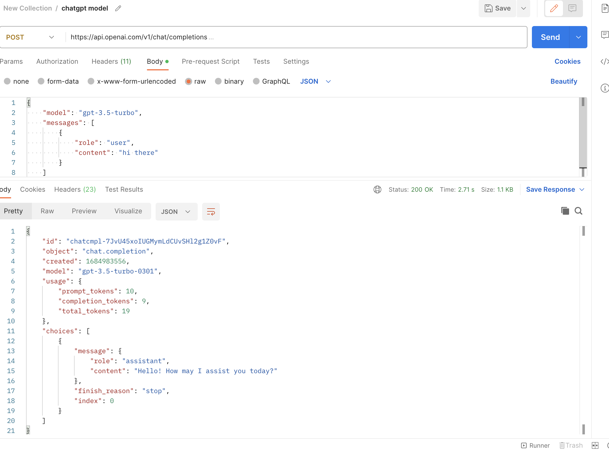
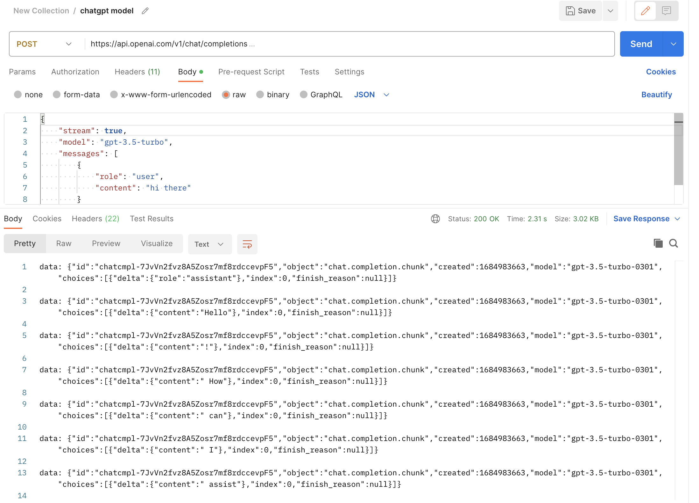
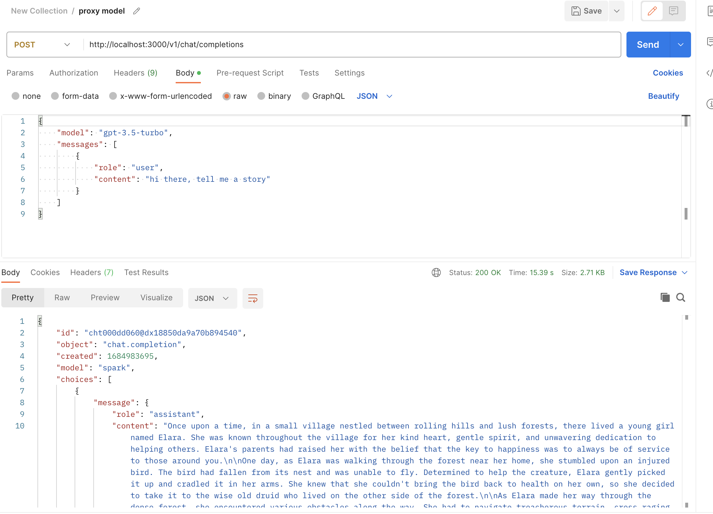
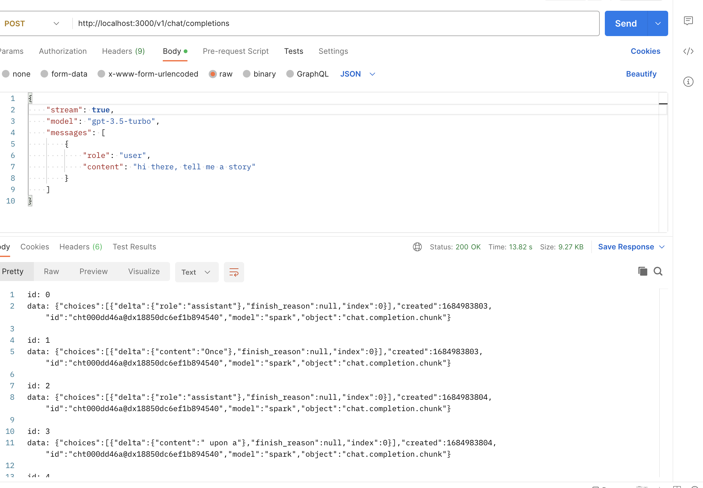

# spark sidecar

## 星火大模型转ChatGPT style调用服务

服务提供将星火大模型的服务接口转为ChatGPT style的输入输出，方便调用。

场景：
* ChatGPT开源项目适配：不调整开源项目源码，仅仅调整调用地址即可对接为spark星火大模型
* 效果差异对比：对比ChatGPT和spark星火大模型的效果差异

### 效果

#### ChatGPT原生调用（非流式）



#### ChatGPT原生调用（流式）



#### spark调用（ChatGPT style非流式）



#### spark调用（ChatGPT style流式）




### 使用方法

```bash
git clone repo
cd repo
npm install
cp const/conf-example.js const/conf.js
vi const/conf.js //填入你的spark调用密钥
npm start
```
服务见:`http://localhost:3000`